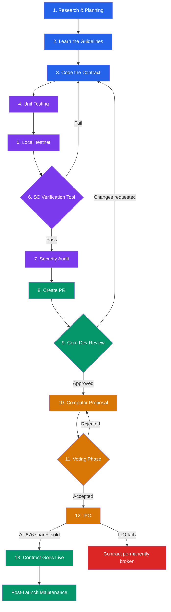

# Smart Contract Lifecycle

This guide covers the complete journey of a Qubic smart contract — from initial research through deployment and post-launch maintenance. Whether you're planning your first contract or preparing for deployment, use this page as your roadmap.

## The Full Process at a Glance

**Legend:**
🔵 Development &nbsp;&nbsp; 🟣 Testing & Validation &nbsp;&nbsp; 🟢 Submission & Milestones &nbsp;&nbsp; 🟠 Governance &nbsp;&nbsp; 🔴 Failure

---

## Before You Start

Before diving into code, here are some practical tips:

- **Be comfortable with C++** — Qubic uses a restricted C++ variant (no pointers, no floats, no standard library)
- **Study existing contracts** — Read the source code of [QX, Quottery, QEARN, QVault, and others](https://github.com/qubic/core/tree/main/src/contracts) to understand real-world patterns
- **Have a solid business model** — Your contract may not generate direct developer fees. Think about how your contract creates value
- **Design shareholder dividends** — Good dividend/fee distribution for shareholders incentivizes higher IPO bids, which means a bigger execution pool for your contract
- **Consider a Qubic Grant** — The [grant program](/developers/grants) can support your development costs
- **Join the community** — The core developers on [Discord](https://discord.gg/qubic) are available to help. Don't hesitate to ask questions
- **Plan your timeline** — The minimum time from start to go-live is roughly **3 weeks**, though most contracts take longer

---

## Timeline Overview

| Phase | Typical Duration | Notes |
|-------|-----------------|-------|
| Development (1–5) | Weeks to months | Depends on complexity |
| Verification + Audit (6–7) | 1–2 weeks | Audit is highly recommended |
| PR Review (8–9) | 1–3 weeks | Submit 2–3 weeks before planned proposal |
| Proposal + Voting (10–11) | 1 epoch (~7 days) | Epoch X |
| IPO (12) | 1 epoch (~7 days) | Epoch X+1 — all 676 shares must sell |
| Go Live (13) | Next epoch | Epoch X+2 — automatic |

---

## Phase 1: Research & Planning

Before writing any code, understand the landscape.

- Read the official [Smart Contract Development Guide](https://github.com/qubic/core/blob/main/doc/contracts.md) in the core repository — this is the canonical reference for requirements, PR expectations, and deployment rules
- Browse [existing contracts on GitHub](https://github.com/qubic/core/tree/main/src/contracts) — study QX, Quottery, QEARN, QVault, and others
- Understand the [execution fee model](/learn/contract-execution-fees) — every contract needs a positive execution fee reserve to keep running. The IPO is primarily the instrument that generates this initial execution pool
- Learn how execution pool replenishment works: IPO proceeds, burning fees collected from users (`qpi.burn()`), or donations via QUtil's `BurnQubicForContract`
- Think about your contract's economics: How will it sustain itself? What value does it create for shareholders?

---

## Phase 2: Learn the Guidelines

Qubic smart contracts are written in a restricted C++ variant. Familiarize yourself with the rules before coding.

- Read the [SC Overview](overview.md) for the architecture (baremetal execution, no VM, no gas)
- Study [Restrictions](smart-contract/restrictions.md) — no pointers, no floats, no preprocessor directives, no division operator (use `div()`/`mod()`), no recursion beyond depth 10
- **1 GB memory limit** — your complete data and logic must fit within this limit
- **No external includes** — only the [QPI (Qubic Programming Interface)](smart-contract/qpi.md) is available
- Review [Code Style](smart-contract/code-style.md) — camelCase for functions, ALL_CAPS for constants
- Understand [Data Types](smart-contract/data-types.md) — custom QPI types only (sint/uint, Array, HashMap, etc.)
- Learn [Procedures and Functions](smart-contract/procedures-and-functions.md) — functions are read-only, procedures modify state

---

## Phase 3: Code the Contract

Time to write your contract.

- Follow the [Getting Started tutorial](getting-started/setup-environment.md) to set up Visual Studio and clone the Qubic Core repo
- Follow [Add Your Contract](getting-started/add-your-contract.md) for the step-by-step walkthrough
- Choose a **unique name**: max 7 capital letters/digits for the asset name (e.g., `QX`, `QTRY`, `QEARN`)
- Place your contract header in `src/contracts/YourContract.h`
- Register it in `src/contract_core/contract_def.h` (contract index, state, description)
- **Plan for fee sustainability**: charge invocation rewards in your procedures and regularly burn collected fees via `qpi.burn()` to replenish the execution fee reserve
- Design your **shareholder dividend model** — contracts that share revenue with shareholders tend to attract higher IPO bids, resulting in a larger initial execution pool

For advanced topics, see:
- [Contract Structure](smart-contract/contract-structure.md)
- [States](smart-contract/states.md)
- [Cross-Contract Calls](smart-contract/cross-inner-call.md)
- [Assets and Shares](smart-contract/assets-and-shares.md)

---

## Phase 4: Unit Testing

Every contract must be thoroughly tested using the GoogleTest (GTest) framework.

- Follow [Test Your Contract](getting-started/test-your-contract.md) for the initial setup
- See [Contract Testing](testing/contract-testing.md) for detailed patterns (calling functions, invoking procedures, querying state, mocking data)
- Your contract must compile with **zero errors and zero warnings**
- Write comprehensive tests — the core dev review will check test coverage

---

## Phase 5: Local Testnet

Test your contract in a realistic network environment.

- **Recommended**: Use [Qubic Core Lite](resources/qubic-lite-core.md) to run a local testnet directly on your OS — no VM needed
- Alternatively, set up a [full testnet with VirtualBox](testing/testnet.md)
- The [Qubic Dev Kit](https://github.com/qubic/qubic-dev-kit) can streamline the process
- Monitor contract execution across multiple ticks
- Test multi-node behavior to verify determinism

---

## Phase 6: SC Verification Tool

Before submitting your PR, run the [Contract Verification Tool](resources/contract-verify-tool.md).

- Tool: [qubic-contract-verify](https://github.com/Franziska-Mueller/qubic-contract-verify)
- This automatically checks that your C++ code complies with all of Qubic's language restrictions
- **Your contract must pass verification** — this is a prerequisite for PR submission

:::tip
Run the verification tool early and often during development, not just at the end. It's much easier to fix restriction violations while you're still actively coding.
:::

---

## Phase 7: Security Audit (Optional but Highly Recommended)

Consider engaging a third-party security auditor to review your contract.

- A professional audit adds credibility and can catch vulnerabilities that testing misses
- Include the audit report with your PR — it strengthens the case for approval
- The community and core developers will also review your code, but a formal audit is a strong signal of quality

:::warning
Qubic favors quality over quantity. A well-audited contract has a much better chance of passing core dev review and computor voting.
:::

---

## Phase 8: Create the Pull Request

Submit your contract to the [qubic/core](https://github.com/qubic/core) repository.

Your PR must include:
- Contract header file in `src/contracts/YourContract.h`
- Contract registration in `src/contract_core/contract_def.h` (index, state type, description, registration)
- GoogleTest test file: `test/contract_yourcontract.cpp`
- Documentation describing the contract's purpose and interface
- SC Verification Tool results (passing)
- Security audit report (if available)

Requirements:
- Target branch: **`develop`**
- Zero compiler errors, zero warnings
- Comprehensive test coverage

:::tip Timing
Submit your PR **at least 2–3 weeks before** you plan to submit a computor proposal. Core dev review takes time, and you may receive change requests that require iteration.
:::

---

## Phase 9: Core Dev Review

The Qubic core developers will review your PR for code quality, security, and correctness.

- Expect questions and change requests — this is normal
- Iterate on feedback until the review is approved
- Once approved, the PR is merged into the `develop` branch
- The contract will be included in the next release build

---

## Phase 10: Computor Proposal (Epoch X)

With your PR approved and merged, it's time to propose your contract to the network.

- A computor operator submits a proposal via the **GQMPROP** contract
- Each proposer can maintain only one active proposal per epoch
- For general proposal mechanics, see [Proposals](/learn/proposals)

**Create a written proposal:**

1. Submit a PR to the [qubic/proposals](https://github.com/qubic/proposals) repository, placing your proposal in the `SmartContracts` folder — use existing proposals as templates and include the link to your [core repository](https://github.com/qubic/core) PR
2. A repository maintainer reviews and merges your proposal
3. A computor operator can then reference your merged proposal when submitting the GQMPROP on-chain proposal

:::info
Proposals are valid only for the current epoch (~7 days). If the vote doesn't conclude in time, you'll need to submit a new proposal in the next epoch.
:::

---

## Phase 11: Voting Phase

The computors vote on whether to accept your contract.

- **451 of 676 computors** must participate for the vote to be valid (quorum)
- A **majority** of valid votes must be in favor
- If no option gets >50%, a runoff vote with the top 2 options is needed
- For detailed voting rules, see [Smart Contracts Voting](/learn/smart-contracts#voting-rules)

---

## Phase 12: IPO — Dutch Auction (Epoch X+1)

If the proposal is accepted, the IPO begins in the next epoch.

- **676 shares** of your contract are offered via [Dutch Auction](/learn/dutch-auction)
- Anyone can bid during the one-week auction period
- All successful bidders pay the lowest winning bid price (see [Dutch Auction details](/learn/dutch-auction))
- The IPO proceeds generate the **initial execution fee reserve**: `finalPrice × 676`
- This reserve powers all future contract execution

:::danger Critical — IPO Must Succeed
**All 676 shares must be sold.** If the IPO fails (not all shares are purchased), your contract is **permanently broken** — it cannot be re-IPO'd, the execution fee reserve stays at zero, and it can never be activated. Plan your community outreach and marketing for the IPO carefully.
:::

**What drives IPO success:**
- A compelling use case that people want to invest in
- Good shareholder dividend/fee distribution rules in your contract
- Active community engagement before and during the IPO period
- Transparent documentation and audited code

---

## Phase 13: Contract Goes Live (Epoch X+2)

In the epoch following a successful IPO, your contract is automatically constructed and activated.

- The contract begins executing with its funded execution pool
- Users can start interacting with it via transactions (procedures) and network messages (functions)
- Historical pattern from existing contracts: *"proposal in epoch N, IPO in N+1, construction and first use in N+2"*

---

## Post-Launch Maintenance

Your contract is live — but the work isn't over.

### Bug Fixes
Bug fixes can be submitted as regular PRs to `qubic/core` **without** a new computor proposal. The core team reviews and merges fixes through the standard development process.

### New Features
Any new feature or significant change to your contract **requires a new computor proposal** and voting phase.

### Execution Fee Management
- Monitor your contract's execution fee reserve regularly
- Replenish the reserve by burning invocation rewards collected from users (`qpi.burn()`)
- Anyone can also donate to your contract's reserve via QUtil's `BurnQubicForContract` procedure
- **If the execution pool reaches zero, your contract stops executing entirely**
- For detailed best practices, see [Contract Execution Fees](/learn/contract-execution-fees)

### Shareholder Proposals
After launch, shareholders can propose and vote on changes to contract state variables. This is implemented via the shareholder proposal voting system. See the [contracts proposals documentation](https://github.com/qubic/core/blob/main/doc/contracts_proposals.md) for technical details.

### Stay Active
Computors may periodically run cleanup routines that remove unused or unneeded smart contracts. Keep your contract actively used and useful to the network.

---

## Pre-Submission Checklist

Before submitting your PR, verify that everything is in order:

- [ ] Contract compiles with zero errors and zero warnings
- [ ] GoogleTest tests are comprehensive and all pass
- [ ] SC Verification Tool passes
- [ ] Tested on local testnet (Core Lite or full testnet)
- [ ] Execution fee sustainability is planned (invocation rewards + burn logic)
- [ ] Security audit completed (highly recommended)
- [ ] PR targets the `develop` branch
- [ ] Documentation describes contract purpose and interface
- [ ] Community outreach for IPO is planned
