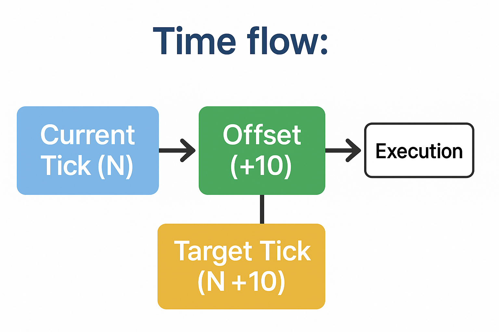
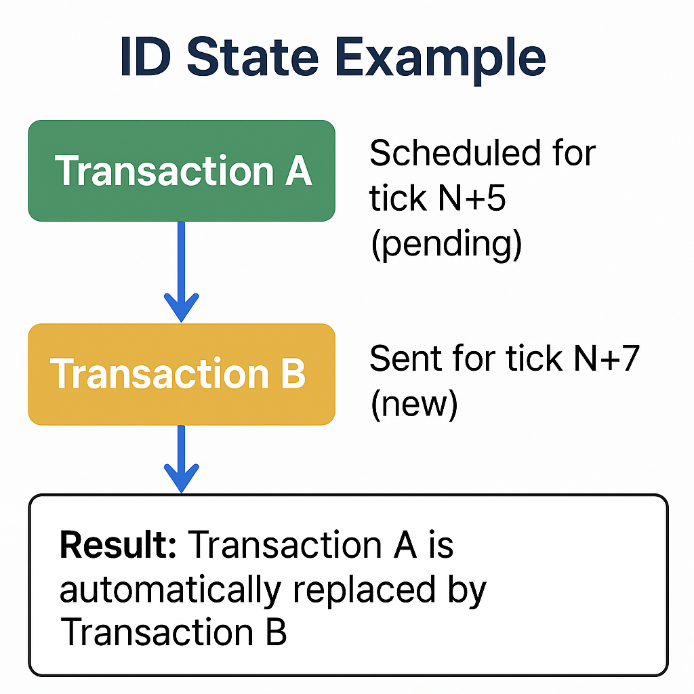

# Ticks and Concurrency

## 1. Ticks vs Blocks

**Different paradigm**: Qubic does NOT use blocks, it uses "ticks"

Unlike traditional blockchains where transactions are grouped into blocks that are created every few minutes, Qubic operates on a fundamentally different architecture. The core unit of time and consensus is called a "tick."

- **Tick definition**: A complete network state snapshot that occurs every ~0.2–5 seconds, containing all validated transactions and their effects for that specific moment in time.
- **Instant finality via quorum votes**: Once a tick receives votes from the quorum of 676 Computors, the transactions within it are immutably final. There is no concept of multiple confirmations like in Bitcoin – a transaction either succeeded in that tick or it didn’t.
- **Independent snapshots with quorum validation**: Unlike blockchain blocks that contain cryptographic hashes linking them to previous blocks, ticks do not reference previous ticks through hash chains. However, each tick is accepted based on quorum votes, which ensures consistency across the network
- **Automatic pruning**: At the end of each epoch (exactly 7 days), all historical transaction data is completely deleted from the network. Only the final account balances and essential state information survive into the next epoch. This radical approach eliminates blockchain bloat entirely

## 2. Tick Offset - Temporal Programming

**Critical concept**: Transactions must be scheduled for future execution

One of the most important concepts to understand in Qubic is that you cannot send a transaction for immediate execution. Instead, you must schedule transactions to execute at a specific future tick. This is fundamentally different from traditional blockchains where you submit a transaction and wait for miners to include it in the next available block.

```
Time flow:
Current Tick (N) → Offset (+10) → Target Tick (N+10) → Execution
```



**Why this architecture exists**:

- **Performance optimization**: By knowing exactly when transactions will execute, the network can optimize processing and achieve much higher throughput
- **Deterministic execution**: This prevents race conditions and makes the network behavior completely predictable
- **Resource planning**: Computors can prepare for the computational load of upcoming ticks

**Architectural implications**:

- **No mempool**: Because transactions are scheduled for specific ticks, there's no need for a traditional mempool where transactions wait to be processed. Either your transaction makes it into its designated tick or it's lost forever
- **Deterministic execution**: You must specify exactly WHEN your transaction will execute (the target tick number), not just submit it and hope for the best
- **Time window planning**: You need a minimum of 3 ticks offset to ensure network propagation, though most applications use 10+ ticks for safety
- **Single opportunity**: If the target tick passes and your transaction wasn't included (due to network issues, invalid signature, etc.), the transaction is irreversibly lost. There's no retry mechanism - you must create and send a new transaction

## 3. Concurrency Restriction

**Current limitation**: An identifier (ID) can currently have only **one pending transaction** at a time.

This may be surprising for developers coming from other blockchain platforms. In Qubic, each identity (public key) generally has only one pending transaction at a given moment. This restriction exists for technical reasons related to how the network maintains state consistency, although future updates may allow multiple pending transactions per identity.

```
ID State Example:
- Transaction A scheduled for tick N+5 (pending)
- Transaction B sent for tick N+7 (new)
- Result: Transaction A is automatically replaced by Transaction B
```



**Practical implications** (subject to change with future updates):

- **Transaction replacement**: If you send a new transaction while another is pending, the old one may currently be discarded.
- **Timing coordination**: Carefully plan the timing of multiple operations from the same identity.
- **No batching**: Currently, you cannot send multiple transactions simultaneously from the same identity.

**Mitigation strategies**:

- **Sequential timing**: Space out transactions to different future ticks (e.g., tick N+5, N+6, N+7).
- **Temporary identities**: Create additional key pairs for operations that need to happen in parallel.
- **Application-level queuing**: Implement transaction queues in your application logic to manage multiple operations.
- **State checking**: Always verify the current pending transaction before sending a new one.


