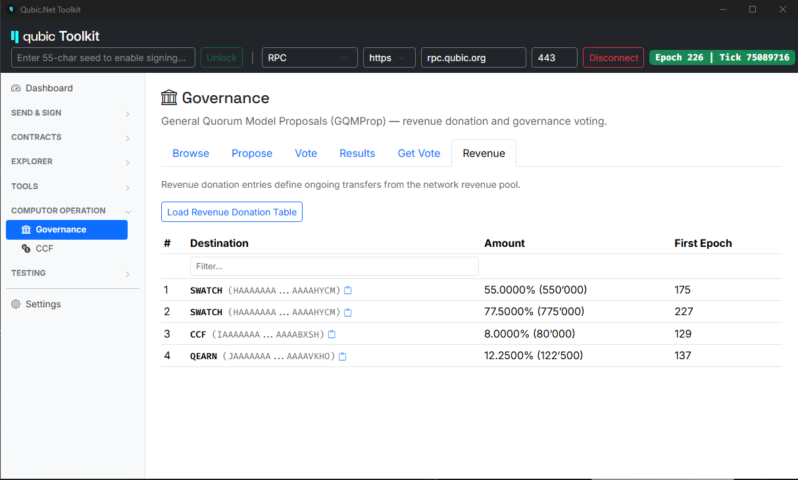

# Inspect network state

Qubic's live protocol state — balances, epoch, tick, computor set, contract state, revenue routing, and everything else the network agrees on — is queryable. You do not have to trust a website, a screenshot, or a tweet. You can read the state directly.

This page shows you how, using three complementary tools, and walks through one worked example (the revenue-donation table) end-to-end.

## Mental model

All three tools query the **same on-chain state**. What differs is the interface:

- **`qubic-cli`** — a command-line binary that speaks the node protocol directly. Best for scripting, automation, and reproducible checks in CI.
- **Qubic.Net Toolkit** — a graphical desktop application. Best for browsing and one-off inspection when you'd rather click than type.
- **HTTP RPC** (`rpc.qubic.org`) — a JSON API over HTTPS. Best for embedding in your own dashboards, websites, or backend services.

You will see the same values in all three, because all three ultimately ask the same node the same question. If the values disagree, one of the tools is stale — not the protocol.

## Tools

### 1. `qubic-cli`

The command-line client lives at [`github.com/qubic/qubic-cli`](https://github.com/qubic/qubic-cli). It builds cross-platform (Linux, macOS, Windows) and takes a node IP as its target:

```bash
qubic-cli -nodeip <IP> -nodeport 21841 -<command> [args]
```

Public read-only queries do not require a seed. State-changing operations (transfers, votes, proposals) do.

Run `qubic-cli -help` for the full command surface, or see the [`README.md`](https://github.com/qubic/qubic-cli/blob/main/README.md).

### 2. Qubic.Net Toolkit

A desktop GUI for browsing the network, at [`github.com/qubic/qubic-net-toolkit`](https://github.com/qubic/qubic-net-toolkit) (or from the Qubic downloads page). Best for humans; connects to a node over the same protocol `qubic-cli` uses.

Header shows the currently connected node, epoch, and tick. Left sidebar groups queries by domain (Dashboard, Contracts, Explorer, Tools, Computor Operation, Testing).

### 3. HTTP RPC

`https://rpc.qubic.org` exposes a JSON API for the most common queries. Suitable for embedding state into your own web app or dashboard. See [API · RPC](../api/rpc.md) for the endpoint list.

---

## Worked example — the revenue donation table

The **revenue donation table** is the on-chain routing configuration that decides what fraction of each computor's revenue goes to a set of destination public keys (typically the burn-sink SC or the CCF/QEARN contracts). The table lives in the `GQMPROP` contract's state and is updated by quorum vote. Its behavior underlies things like "the halving" — a halving is a quorum-approved bump to a `millionthAmount` field routed to the burn sink.

Every tool below returns the same table.

### With `qubic-cli`

```bash
qubic-cli -nodeip <IP> -nodeport 21841 -gqmpropgetrevdonation
```

Prints the current table as text, one row per entry: destination public key, `millionthAmount` (in millionths of the incoming revenue), and `firstEpoch` (the first epoch the entry becomes active).

### With the Qubic.Net Toolkit

**Governance → Revenue tab → Load Revenue Donation Table**



The screenshot above is EP226 mainnet. It shows the same four entries you'd get from `qubic-cli`, plus friendly names for the destination public keys where the toolkit recognizes them (SWATCH, CCF, QEARN).

### With HTTP RPC

Any smart-contract function is callable through the generic `POST /v1/querySmartContract` endpoint. The revenue donation table is `GQMPROP.GetRevenueDonation` — contract index **6**, input type **5**, no request body:

```bash
curl -X POST 'https://rpc.qubic.org/v1/querySmartContract' \
  -H 'Content-Type: application/json' \
  -d '{
    "contractIndex": 6,
    "inputType": 5,
    "inputSize": 0,
    "requestData": ""
  }'
```

The response has a `responseData` field containing the base64-encoded `RevenueDonationT` struct (see [`contracts/GeneralQuorumProposal.h`](https://github.com/qubic/core/blob/main/src/contracts/GeneralQuorumProposal.h) for the struct layout). Decode it to get the same rows the CLI and Toolkit show — one 32-byte `destinationPublicKey`, one 4-byte `millionthAmount`, one 2-byte `firstEpoch` per entry.

For details on the endpoint pattern (base64 in/out, error handling), see [API · RPC](../api/rpc.md).

### With the TypeScript SDK

The `@qubic.org/contracts` package ships generated helpers for every core contract. `GQMPROP.GetRevenueDonation` is available as a one-line call — no manual base64 or byte offsets to manage:

```ts
import { qubicRpc } from '@qubic.org/rpc'
import { generalQuorumProposalGetRevenueDonation } from '@qubic.org/contracts'

const rpc = qubicRpc({ baseUrl: 'https://rpc.qubic.org' })
const result = await generalQuorumProposalGetRevenueDonation(rpc.live)

if (result.ok) {
  // result.value.data is the decoded RevenueDonationT byte payload —
  // 128 entries × 42 bytes each (pk[32] || millionthAmount[8] || firstEpoch[2]).
  // Loop until you hit a zero destinationPublicKey (empty slot).
  console.log(result.value.data)
}
```

### With the .NET SDK

`Qubic.Net` generates typed clients per contract. `GetRevenueDonation` returns a strongly-typed `Entries[]` — you get named fields directly, no byte parsing:

```csharp
using Qubic.Core.Contracts.Gqmprop;
using Qubic.Rpc;

var client = new QubicRpcClient("https://rpc.qubic.org");

var result = await client.QuerySmartContractAsync<GetRevenueDonationInput, GetRevenueDonationOutput>(
    GqmpropContract.ContractIndex,
    GqmpropContract.Functions.GetRevenueDonation,
    new GetRevenueDonationInput());

foreach (var entry in result.Entries)
{
    if (entry.DestinationPublicKey.All(b => b == 0)) break; // empty slot marks end
    Console.WriteLine(
        $"→ dest={Convert.ToHexString(entry.DestinationPublicKey)[..12]}… " +
        $"{entry.MillionthAmount / 10_000.0:F2}% " +
        $"(firstEpoch: {entry.FirstEpoch})");
}
```

For both SDKs, the underlying wire call is the same `POST /v1/querySmartContract` you saw above. The SDKs handle base64 encoding, byte offsets, and struct layout for you — that's their whole job.

### How to read the result

Each entry has three fields:

| Field | Meaning |
|---|---|
| `destinationPublicKey` | Where the routed portion of revenue goes (usually a smart-contract public key) |
| `millionthAmount` | Fraction (in millionths — `1_000_000` = 100%) of the *remaining* revenue that gets routed here |
| `firstEpoch` | The epoch this entry becomes active |

Entries are applied **sequentially** at each epoch's end, per computor: each entry takes its `millionthAmount / 1_000_000` fraction of what remains after previous deductions. What's left after all entries have been applied is what the computor receives.

An entry with `firstEpoch > currentEpoch` is stored on-chain but not yet applied — it's a future change, already ratified by quorum. When the network reaches that epoch, the entry activates and any older entry with the same `destinationPublicKey` is automatically removed (see `_CleanupRevenueDonation` in [`contracts/GeneralQuorumProposal.h`](https://github.com/qubic/core/blob/main/src/contracts/GeneralQuorumProposal.h)).

---

## Other common queries

The same "same-state-different-interface" pattern applies across every read-only query. A few of the most commonly used:

| What you want | `qubic-cli` command | Toolkit path |
|---|---|---|
| Balance of an identity | `-getbalance <IDENTITY>` | Dashboard / Explorer |
| Assets held by an identity | `-getasset <IDENTITY>` | Explorer → Assets |
| Current computor list | `-getcomputorlist <FILE>` | Explorer → Computors |
| Tick data (all txs in a tick) | `-gettickdata <TICK> <FILE>` | Explorer → Tick |
| Transaction lookup | `-gettxinfo <TX_ID>` | Explorer → Transaction |
| Contract fee reserve | `-qutilqueryfeereserve <IDX>` | Contracts → Fee reserves |
| Revenue donation table | `-gqmpropgetrevdonation` | Governance → Revenue |
| Peer network | `-getnodeiplist` | Settings → Network |

For the exhaustive list, `qubic-cli -help` is authoritative; the toolkit exposes most of the same queries through its sidebar.

## When answers disagree between tools

Three usual causes:

1. **Different nodes.** If `qubic-cli` and the toolkit are pointed at different node IPs, they may briefly see different values (typically for at most one or two ticks — Qubic's finality is per-tick).
2. **Stale toolkit connection.** Reconnect the toolkit; it caches the connection but does not always auto-refresh derived tables.
3. **Newer future-epoch entries.** Some tables (like the revenue-donation table) contain entries with a `firstEpoch` in the future. Tools may render them differently — some show only currently-active entries, some show the full table including future entries. Look at the `firstEpoch` column.

Never assume a tool is wrong before checking against a second tool. When they agree, the state is the state.

## Related

- [Consensus](../overview/consensus.md) — how the network agrees on the state you're inspecting
- [Upgrading](../computors/upgrading.md) — the transitions doc; explains what "the same state on every node, every tick" actually means
- [Tokenomics (draft)](./tokenomics.md) — for the context of what the revenue donation table implements
- [API · RPC](../api/rpc.md) — the HTTP endpoint reference
- [`qubic-cli` README](https://github.com/qubic/qubic-cli/blob/main/README.md) — full CLI command reference
- [TypeScript SDK (`@qubic.org/rpc`, `@qubic.org/contracts`)](../developers/library-typescript.md) — one call per contract function
- [.NET SDK (`Qubic.Net`)](../developers/library-csharp.md) — typed clients per contract, generated from the core source
